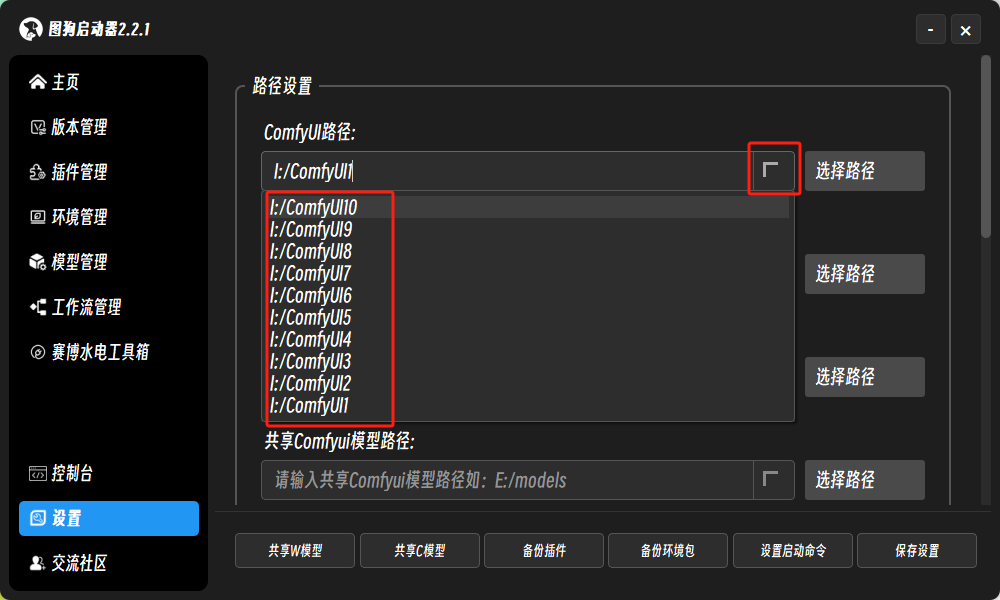
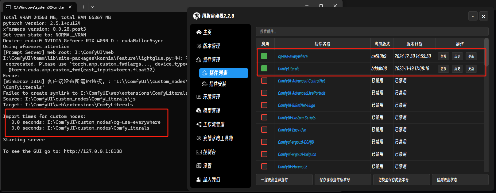
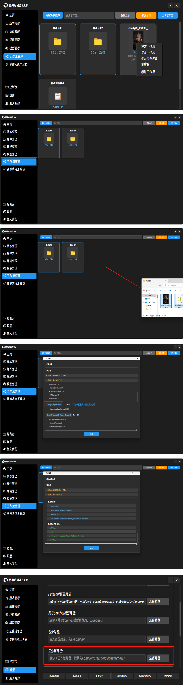
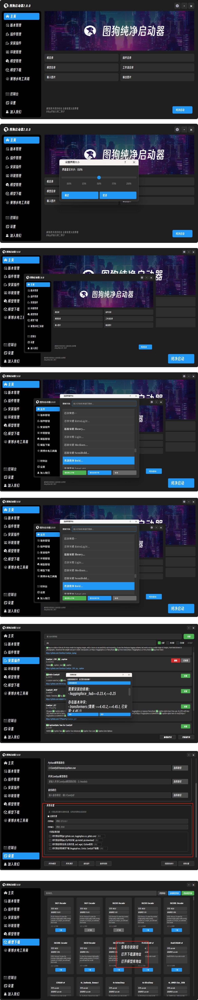
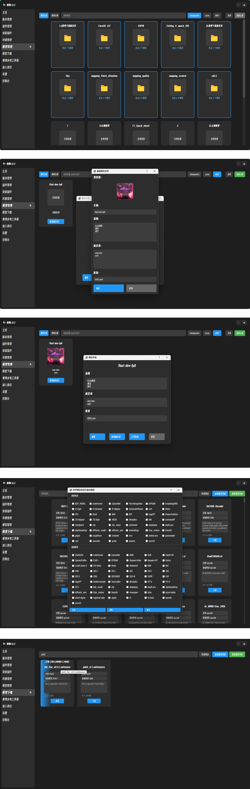
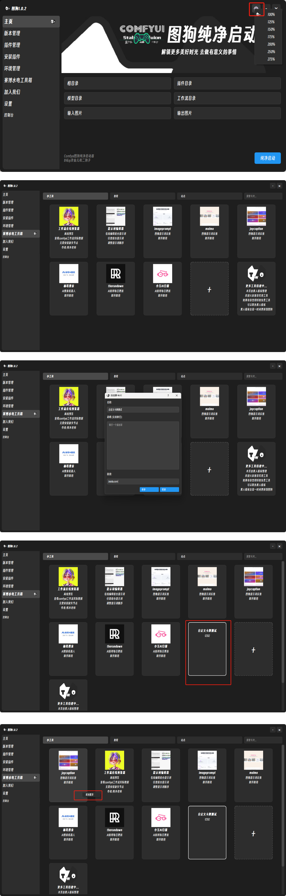
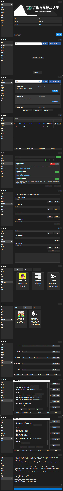

 ## 项目简介    
更纯净的Comfyui启动器    
推荐配合官方web版本使用    
[官方下载链接](https://github.com/comfyanonymous/ComfyUI/releases/latest/download/ComfyUI_windows_portable_nvidia.7z)     
[Comfyui图狗启动器使用教程](https://www.bilibili.com/video/BV1RhrqYrEiA/?share_source=copy_web&vd_source=766e97e9a72d0634f585e86f359dc8d6)     
首次使用请先设置Comfyui路径与python解释器路径点击保存设置    
通过多种一键设置在不改变 Comfyui 的原生项目代码基础上进行文件/功能的设置管理
欢迎加入Comfyui社群共同学习交流/二狗子微信：S68SAK         
以下是部分功能说明：    
1. 一键更新    
2. 本体版本管理，本体版本历史切换记录    
3. 插件安装，多插件历史版本一键切换    
4. 依赖安装（单个，群体）    
5. 依赖冲突解决(分析依赖冲突解决办法)    
6. 依赖冲突查询（安装依赖与本地依赖的配对结果）    
7. 依赖镜安装源像设置    
8. 模型共享（Comfyui/WebUI）    
9. 环境共享    
10. 环境备份    
11. 插件备份    
12. 一键远程调用启动    
13. 启动设置（启动端口，输入输出目录设置，精度调整，多卡 gpu 选择，自定义节点禁用，启动脚本设置等……）    
14. 开源工具使用    
15. 开源教程查看    
16. 模型管理    
17. 模型下载    
18. 工作流管理    
19. 工作流解析
更多功能待建中......        

 ## 2025/1/18 2.2.1版更新    
1.新增comfyui等路径输入历史保存快速切换/方便多包快速切换/最多保存10个保存过的设置路径    
2.优化更新脚本/不再覆盖所有文件，保留设置和其它配置文件        
       
     

 ## 2025/1/17 2.2.0版更新    
1.插件管理新增插件禁用功能    
ps：部分插件会将js文件导入web文件夹，可能导致bug，请使用禁用功能时删除web导入的js扩展    
2.优化插件更新和切换依赖检测    
3.优化启动命令设置输入输出目录后主页可同步    
4.优化自定义工作流目录后，纯净启动报错问题 
ps:更新启动器时仅需覆盖exe文件，可保留设置文件        
       
     

 ## 2025/1/13 2.1.0版更新    
 1.新增工作流管理功能    
 2.支持自定义目录(无自定义则为默认包工作流地址)    
 3.支持拖拽保存工作流JSON\PNG\置顶\锁定\重命名
 4.支持启动器内点击查看工作流节点信息\所属插件\部分模型\提示词    
 5.支持启动器内拖拽到comfyui打开工作流     
     
     
    
 ## 2025/1/12 2.0.0版更新    
1.重做ui    
2.新增ui自定义缩放    
3.新增自定义字体设置（测试功能，如遇错误请切换为默认字体）    
4.新增插件安装时检测本地依赖冲突，由用户决定是否继续安装    
5.新增网络代理    
6.新增模型下载右键功能（查看保存路径/打开下载源/打开下载仓库）    
7.新增部分卡牌    
8.优化启动命令设置互斥功能/同类命令自动互斥    
9.修复部分已知bug    
感谢热心市民@ZiYao设计的新logo    
    
再次感谢B站UP啦啦啦的小黄瓜精心录制的使用教程 

 ## 2025/1/09 使用教程发布      
再次感谢B站UP啦啦啦的小黄瓜精心录制的使用教程    

 ## 2025/1/05 1.2.0版更新    
新增环境管理自定义安装命令    
新增模型管理系统    
新增功能模型下载系统    
    
感谢@葫芦娃大佬帮助测试    
 
 ## 2025/1/05 1.0.2版更新    
新增主页窗口大小设置按钮    
新增卡牌系统部分内容    
新增卡牌系统自定内容    
新增卡牌系统置顶功能    
    

 ## 2025/1/03    
测试版发布    

 ## 2025/1/04    
页面展示    
   
关注我们/获取更多信息    
[灵仙儿二狗子的Bilibili空间](https://space.bilibili.com/19723588?spm_id_from=333.1007.0.0)    
