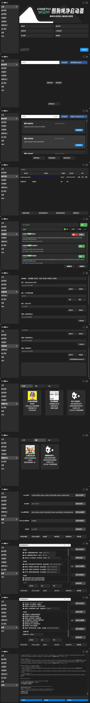

 ## 2025/1/03    
测试版发布    

更纯净的Comfyui启动器    
推荐配合官方web版本使用    
[Comfyui官方下载链接]((https://github.com/comfyanonymous/ComfyUI/releases/latest/download/ComfyUI_windows_portable_nvidia.7z))      
首次使用请先设置Comfyui路径与python解释器路径点击保存设置    
通过多种一键设置在不改变 Comfyui 的原生项目代码基础上进行文件/功能的设置管理    
以下是部分功能说明：    
1. 一键更新    
2. 本体版本管理，本体版本历史切换记录    
3. 插件安装，多插件历史版本一键切换    
4. 依赖安装（单个，群体）    
5. 依赖冲突解决(分析依赖冲突解决办法)    
6. 依赖冲突查询（安装依赖与本地依赖的配对结果）    
7. 依赖镜安装源像设置    
8. 模型共享（Comfyui/WebUI）    
9. 环境共享    
10. 环境备份    
11. 插件备份    
12. 一键远程调用启动（一键自由启动远程生成随机链接/手机电脑随时远程使用Comfyui）     
13. 启动设置（启动端口，输入输出目录设置，精度调整，多卡 gpu 选择，自定义节点禁用，启动脚本设置等……）    
14. 开源工具使用    
15. 开源教程查看    

 ## 2025/1/04    
页面展示    
   
关注我们/获取更多信息    
[灵仙儿二狗子的Bilibili空间](https://space.bilibili.com/19723588?spm_id_from=333.1007.0.0)    
